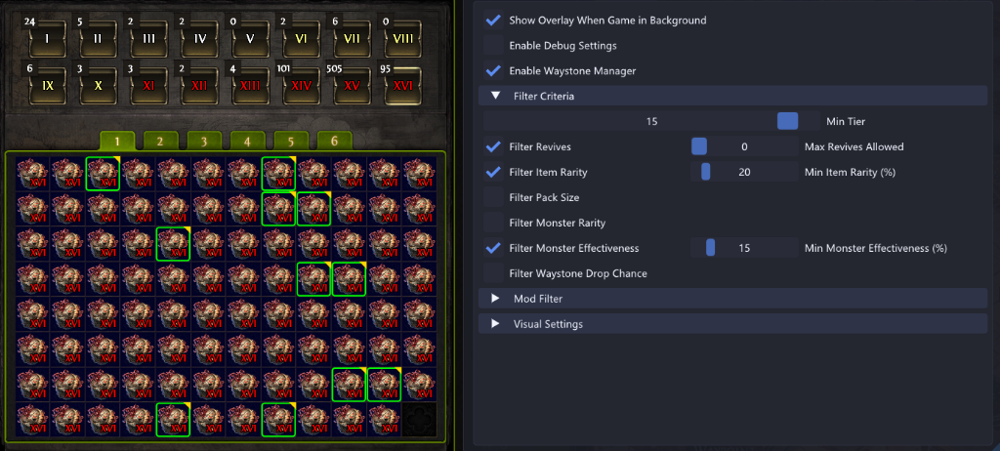

# StashUtility

StashUtility is a plugin for **GameHelper2** designed to manage, filter, and highlight Waystones for Path of Exile 2. It scans active stash tabs and your character's inventory, applying configurable criteria and mod matching to help you quickly identify run-ready waystones and avoid undesirable modifiers.



---

## Features

- **Waystone Tab Integration**: Automatically detects and parses waystones grouped across all 16 tiers in the Waystone stash tab.
- **Normal & Quad Tab Scanning**: Works seamlessly on standard and quad stash tab layouts.
- **Inventory Overlay**: Highlights qualifying waystones in your active character inventory when the panel is open.
- **Granular Filter Criteria**:
  - **Min Tier**: Only highlight waystones equal to or above a specified tier (T1–T16).
  - **Filter Revives**: Limit highlights to waystones with at most $N$ max revives (e.g., filter out 0-revive maps).
  - **Item Rarity (%)**: Enforce a minimum item rarity percentage.
  - **Pack Size (%)**: Enforce a minimum monster pack size percentage.
  - **Monster Rarity (%)**: Filter by minimum rare monster count/rarity percentage.
  - **Monster Effectiveness (%)**: Filter by minimum monster effectiveness percentage.
  - **Waystone Drop Chance (%)**: Enforce a minimum waystone drop chance (includes quality calculations).
- **Mod Matching / Avoidance**:
  - Contains a built-in dropdown database (loaded from `json/mods_data.json`) to select and add bad modifiers to your filter list.
  - Colors the border based on whether the waystone has bad mods (customizable **Good** vs. **Bad** mod colors).
- **Customizable Visuals**:
  - Adjustable border thickness.
  - Optional triangle corner indicators representing item rarity (Normal, Magic, Rare, Unique).
  - Ability to completely hide/ignore Normal (white) waystones.
- **Developer Debug Probe**:
  - **UI Path Explorer**: Graphically traverse the game's ImGui/UI elements to trace container node paths.
  - **Hovered Waystone Inspector**: Inspect components, implicit/explicit/enchant mods, and internal stats of any hovered waystone.
  - **Memory Dumpers**: Extract the complete UI tree or waystone entity memory to text files.

---

## Installation

1. Download the latest release `StashUtility.zip` from the GitHub Releases page.
2. Extract the contents into the `Plugins` directory of your GameHelper2 directory:
   ```text
   GameHelper/
   └── Plugins/
       └── StashUtility/
           ├── StashUtility.dll
           └── json/
               └── mods_data.json
   ```
3. Restart GameHelper2. The plugin will be recognized and loaded automatically.

---

## How to Use

1. **Enable the Plugin**: Open the GameHelper menu, locate the `StashUtility` section, and check **Enable Waystone Manager**.
2. **Set Filters**: Under **Filter Criteria**, toggle and set your desired thresholds for Tier, Pack Size, Rarity, etc.
3. **Configure Bad Mods**:
   - Expand the **Mod Filter** dropdown.
   - Choose a mod pattern from the dropdown list.
   - Click **Add to Bad Mods**.
   - Items containing those substrings will be drawn with the designated **Bad Mod Color** (default Red).
4. **Calibrate UI Path (If Needed)**:
   - If the overlay borders do not align correctly with your stash slots, check the **UI Path Offsets** under debug settings.
   - By default, the path is set to `2,0,0,0,1,1,45,0,1`. You can customize the path indices to match UI changes.

---

## Building from Source

To compile the plugin yourself:

1. Place the `StashUtility` repository folder inside the `Plugins/` directory of the `GameHelper2` project.
2. Open the solution `GameOverlay.sln` in Visual Studio.
3. Select the `Release` build configuration and rebuild the solution.
4. The output will automatically copy `StashUtility.dll` and its assets to `GameHelper\bin\Release\net10.0-windows\win-x64\Plugins\StashUtility`.

---

## Release Workflow (GitHub CI/CD)

The repository uses GitHub Actions to automate releases. When you push a new tag matching `v*` (e.g., `v1.0.0`), the workflow:
1. Clones the parent `GameHelper2` repository.
2. Restores and builds the `StashUtility` plugin in Release mode using .NET 10.
3. Gathers the compiled `.dll`, `.pdb`, and `json/` assets.
4. Packages them into `StashUtility.zip` and uploads them to a newly created GitHub Release.
